.. _contributing:

Contributing to ``ofxtools``
============================
To start hacking on the source, see the section entitled "Developer's
installation" under :ref:`installation`.

Make sure your changes haven't broken anything by running the tests:

.. code:: bash

    python `which nosetests` -dsv  --with-coverage --cover-package ofxtools

Or even better, use ``make``:

.. code:: bash

    make test

After running one of the above commands, you can view a report of which parts
of the code aren't covered by tests:

.. code:: bash

    coverage report -m

Poke around in the Makefile; there's a few developer-friendly commands there.

Feel free to `create pull requests`_ on `ofxtools repository on GitHub`_.

If you commit working tests for your code, you'll be my favorite person.

Adding New OFX Messages
=======================
As an example, I'll document the implementation of bank fund transfers.

Download a copy of the `OFXv2.03`_ spec.  The messages we want to implement
are located in Section 11.7.  Since these messages appear in the hierarchy
under ``BANKMSGSETV1``, we'll put them under ``ofxtools.models.bank``.

Request and Response
--------------------
In order to implement ``INTRARQ`` (the command clients use to request
a funds transfer) we'll first need to define any aggregates it refers to -
in this case, ``XFERINFO``.

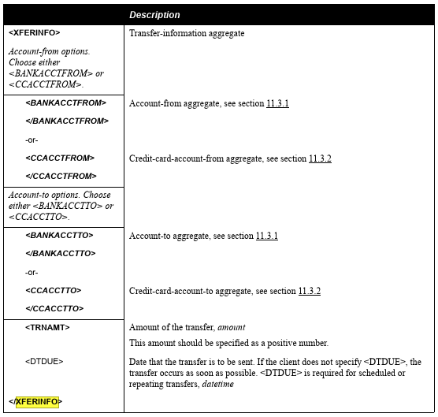

Here's how we translate the spec info Python.

.. code:: python

    from ofxtools.models.base import Aggregate, SubAggregate
    from ofxtools.Types import String, Decimal, DateTime, OneOf
    from ofxtools.models.bank.stmt import (
        BANKACCTFROM, BANKACCTFROM, CCACCTFROM, CCACCTTO,
    )

    class XFERINFO(Aggregate):
        """ OFX section 11.3.5 """

        bankacctfrom = SubAggregate(BANKACCTFROM)
        ccacctfrom = SubAggregate(CCACCTFROM)
        bankacctto = SubAggregate(BANKACCTTO)
        ccacctto = SubAggregate(CCACCTTO)
        trnamt = Decimal(required=True)
        dtdue = DateTime()

        requiredMutexes = [
            ["bankacctfrom", "ccacctfrom"],
            ["bankacctto", "ccacctto"],
        ]

We create a subclass of ``ofxtools.models.base.Aggregate``, where the class
name is the OFX tag in ALL CAPS.  We define a class attribute for each tag
that can appear under ``XFERINFO`` - the attribute names must be all lowercase.

Container aggregates are defined with ``ofx.models.base.SubAggregate``;
pass in the relevant model class.

Data-bearing elements are defined as a subclass of ``ofxtools.Types.Element`` -
``Decimal`` for ``TRNAMT`` and ``DateTime`` for ``DTDUE``, as indicated by
the spec.  The spec prints ``TRNAMT`` in **bold**, which means it is required.
This constraint is enforced simply by passing ``required=True`` to the
attribute definition.

The spec also states that either ``BANKACCTFROM`` or ``CCACCTFROM`` must
appear in ``XFERINFO``, as well as either ``BANKACCTTO`` or ``CCACCTTO``.
We can't simply pass in ``required=True`` to the relevant class attributes -
that would require all of them to appear in any valid ``XFERINFO`` instance,
which is clearly not right.  Instead of attribute-level validation, these
kinds of class-level constraints are enforced by separate class attributes.

In this case, we employ the awkwardly-named
``ofxtools.models.base.Aggregate.requiredMutexes``, which requires that
exactly one of each sequence of attribute names must be passed to
``Aggregate.__init__()``.  Note the lower-case naming.

With ``XFERINFO`` in hand, defining the request aggregate (``INTRARQ``) is simple.

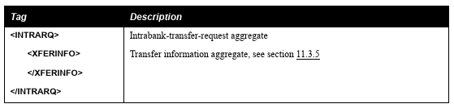

.. code:: python

    class INTRARQ(Aggregate):
        """ OFX section 11.7.1.1 """

        xferinfo = SubAggregate(INTRARQ, required=True)

Now we we move on to the corresponding server response aggregate (``INTRARS``).
``INTRARS`` contains a new subaggregate (``XFERPRCSTS``) for the server
to indicate transfer status; we'll need to implement that first so that
``INTRARS`` can refer to it.  Here's the spec.

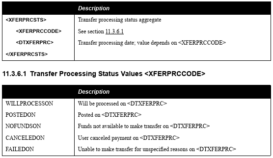

The ``XFERPRCCODE`` element only allows specifically enumerated values.  Our
validator type for that is ``ofxtools.Types.OneOf``.

.. code:: python

    class XFERPRCSTS(Aggregate):
        """ OFX section 11.3.6 """

        xferprccode = OneOf("WILLPROCESSON", "POSTEDON", "NOFUNDSON",
                            "CANCELEDON", "FAILEDON", required=True)
        dtxferprc = DateTime(required=True)

Having ``XFERPRCSTS``, we can define the response aggregate.

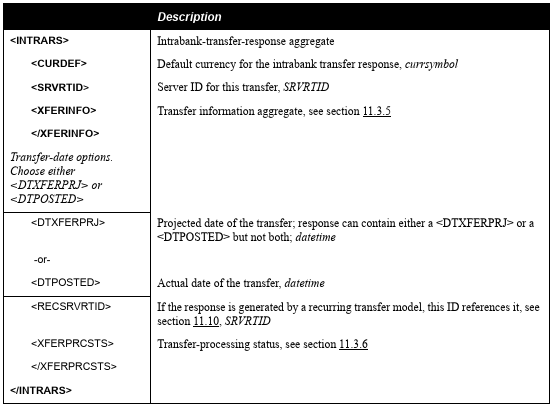

This features a new kind of constraint.  While ``DTXFERPRJ`` and ``DTPOSTED``
are mutually exclusive, the absence of boldface type indicates that it's valid
to omit them both, which means we can't use ``Aggregate.requiredMutexes`` as
we did for ``XFERINFO`` above.

Instead we express this class-level constraint via ``Aggregate.optionalMutexes``,
again using lower-cae attribute names within.

.. code:: python

    from ofxtools.models.i18n import CURRENCY_CODES

    class INTRARS(Aggregate):
        """ OFX section 11.7.1.2 """

        curdef = OneOf(*CURRENCY_CODES, required=True)
        srvrtid = String(10, required=True)
        xferinfo = SubAggregate(XFERINFO, required=True)
        dtxferprj = DateTime()
        dtposted = DateTime()
        recsrvrtid = String(10)
        xferprcsts = SubAggregate(XFERPRCSTS)

        optionalMutexes = [
            ["dtxferprj", "dtposted"],
        ]

The definition of *currsymbol* type refers to the three-letter currency codes
in ISO-4217.  Happily we've already defined them in ``ofxtools.models.i18n``.

Also note the ``ofxtools.Types.String`` validator; it takes an (optional)
length argument of type ``int``.  

n addition to creating account transfers with ``INTRARQ``, there are also 
messages for clients to modify or cancel existing transfer requests.  We'll
just bang these out.

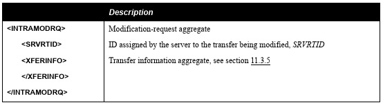

.. code:: python

    class INTRAMODRQ(Aggregate):
        """ OFX section 11.7.2.1 """

        srvrtid = String(10, required=True)
        xferinfo = SubAggregate(XFERINFO, required=True)

.. image:: intramodrs.png

.. code:: python

    class INTRAMODRS(Aggregate):
        """ OFX section 11.7.2.2 """

        srvrtid = String(10, required=True)
        xferinfo = SubAggregate(XFERINFO, required=True)
        xferprcsts = SubAggregate(XFERPRCSTS)

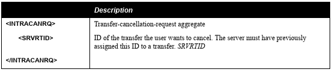

.. code:: python

    class INTRACANRQ(Aggregate):
        """ OFX section 11.7.3.1 """

        srvrtid = String(10, required=True)

.. code:: python

    class INTRACANRS(Aggregate):
        """ OFX section 11.7.3.2 """

        srvrtid = String(10, required=True)

Those are all the basic funds transfer commads, but we're not quite done yet.
Every request or response in OFX is transmitted in a transaction wrapper bearing a
unique identifier, The structure of these wrappers is laid out in Section
2.4.6.1 of the OFX spec.

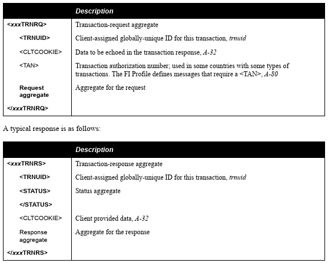

This commonly-repeated pattern is factored out in 
``ofxtools.models.wrapperbases`` as base classes for the various
``*TRNRQ`` / ``*TRNRS`` classes to inherit.

.. code:: python

    class TrnRq(Aggregate):
        trnuid = String(36, required=True)
        cltcookie = String(32)
        tan = String(80)

    class TrnRs(Aggregate):
        trnuid = String(36, required=True)
        status = SubAggregate(STATUS, required=True)
        cltcookie = String(32)

Using these base classes, we just need to add attributes for each type of
request/response they can wrap, along with class-level constraints enforcing
the choice of a single wrapped entity.

Note that ``*TRNRQ`` wrappers **must** contain a request, while the spec
allows empty ``*TRNRS`` wrappers, so we set ``requiredMutexes`` and
``optionalMutexes`` respectively.

.. code:: python

    from ofxtools.models.wrapperbases import TrnRq, TrnRs

    class INTRATRNRQ(TrnRq):
        """ OFX section 11.7.1.1 """

        intrarq = SubAggregate(STMTRQ)
        intramodrq = SubAggregate(INTRAMODRQ)
        intracanrq = SubAggregate(INTRACANRQ)

        requiredMutexes = [
            ["intrarq", "intramodrq", "intracanrq"],
        ]

    class INTRATRNRS(TrnRs):
        """ OFX section 11.7.1.2 """

        intrars = SubAggregate(INTRARS)
        intramodrs = SubAggregate(INTRAMODRS)
        intracanrs = SubAggregate(INTRACANRS)

        optionalMutexes = [
            ["intrars",
            "intramodrs",
            "intracanrs",
            "intermodrs",
            "intercanrs",
            "intermodrs"],
        ]

Recurring Requests
------------------
In addition to one-time fund transfer requests, a bit further down the spec
also details messages for creating, modifying, and canceling recurring funds
transfers.  This just repeats the pattern of ``INTRARQ`` and ``INTRARS``.

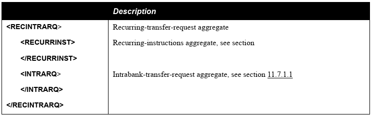

.. code:: python

    class RECINTRARQ(Aggregate):
        """ OFX section 11.10.1.1 """

        recurrinst = SubAggregate(RECURRINST, required=True)
        intrarq = SubAggregate(INTRARQ, required=True)

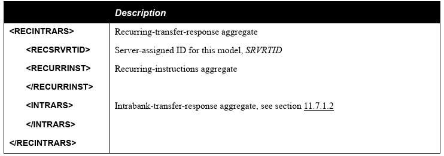

.. code:: python

    class RECINTRARS(Aggregate):
        """ OFX section 11.10.1.2 """

        recsrvrtid = String(10, required=True)
        recurrinst = SubAggregate(RECURRINST, required=True)
        intrars = SubAggregate(INTRARS, required=True)

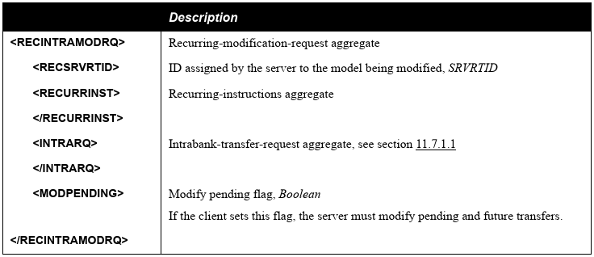

.. code:: python

    class RECINTRAMODRQ(Aggregate):
        """ OFX section 11.10.2.1 """

        recsrvrtid = String(10, required=True)
        recurrinst = SubAggregate(RECURRINST, required=True)
        intrarq = SubAggregate(INTRARQ, required=True)
        modpending = Bool(required=True)

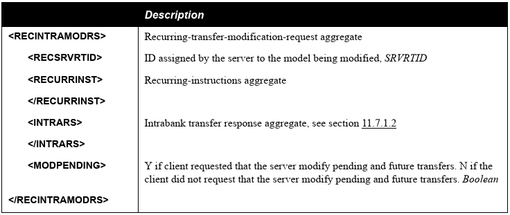

.. code:: python

    class RECINTRAMODRS(Aggregate):
        """ OFX section 11.10.2.2 """

        recsrvrtid = String(10, required=True)
        recurrinst = SubAggregate(RECURRINST, required=True)
        intrars = SubAggregate(INTRARS, required=True)
        modpending = Bool(required=True)

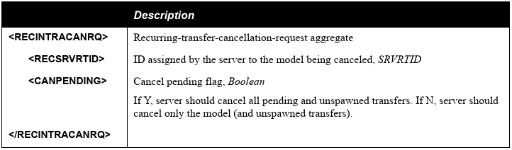

.. code:: python

    class RECINTRACANRQ(Aggregate):
        """ OFX section 11.10.3.1 """

        recsrvrtid = String(10, required=True)
        canpending = Bool(required=True)

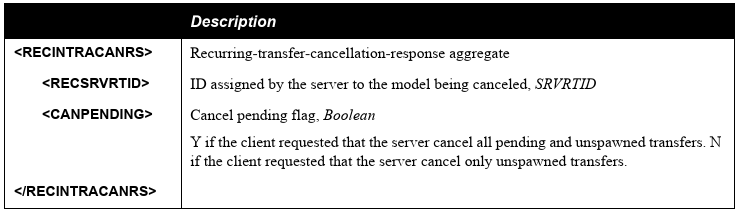

.. code:: python

    class RECINTRACANRS(Aggregate):
        """ OFX section 11.10.3.2 """

        recsrvrtid = String(10, required=True)
        canpending = Bool(required=True)

.. image:: recintratrnrq.png

.. code:: python

    class RECINTRATRNRQ(TrnRq):
        """ OFX section 11.10.1.1 """

        recintrarq = SubAggregate(RECINTRARQ)
        recintramodrq = SubAggregate(RECINTRAMODRQ)
        recintracanrq = SubAggregate(RECINTRACANRQ)

        requiredMutexes = [
            ["recintrarq", "recintramodrq", "recintracanrq"],
        ]

.. image:: recintratrnrs.png

.. code:: python

    class RECINTRATRNRS(TrnRs):
        """ OFX section 11.10.1.2 """

        recintrars = SubAggregate(RECINTRARS)
        recintramodrs = SubAggregate(RECINTRAMODRS)
        recintracanrs = SubAggregate(RECINTRACANRS)

        optionalMutexes = [
            ["recintrars", "recintramodrs", "recintracanrs"],
        ]

Synchronization
---------------
Besides commands to perform funds transfers, the OFX spec also defines messages
for downloading funds transfer activity.  The synchronization protocol and
its messages are detailed in a different chapter of the spec - Section 11.12.2.

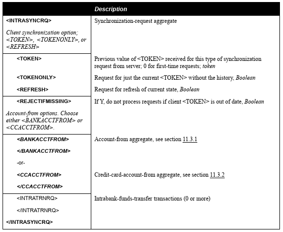

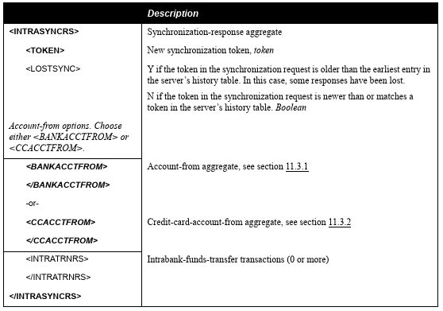

The requirement that each ``*SYNCRQ`` / ``*SYNCRS`` may contain a variable
number of transaction wrappers means that we can't define these wrappers with
``SubAggregate``, which maps every child element to a single class attribute.

Contained aggregates that are allowed to appear more than once are instead
defined with a validator of type ``ListAggregate``, and accessed via the Python list
API.  Unique children are defined in the usual manner, and accessed as instance
attributes.

Here's how it looks in ``ofxtools.models.bank.sync``.

.. code:: python

    from ofxtools.Type import ListAggregate
    from ofxtools.models.bank.stmt import BANKACCTFROM, CCACCTFROM
    from ofxtools.Types import Bool

    class INTRASYNCRQ(Aggregate):
        """ OFX section 11.12.2.1 """
        token = String(10)
        tokenonly = Bool()
        refresh = Bool()
        rejectifmissing = Bool(required=True)
        bankacctfrom = SubAggregate(BANKACCTFROM)
        ccacctfrom = SubAggregate(CCACCTFROM)
        intratrnrq = ListAggregate(INTRATRNRQ)

        requiredMutexes = [
            ["token", "tokenonly", "refresh"],
            ["bankacctfrom", "ccacctfrom"]
        ]

    class INTRASYNCRS(Aggregate):
        """ OFX section 11.12.2.2 """
        token = String(10, required=True)
        lostsync = Bool()
        bankacctfrom = SubAggregate(BANKACCTFROM)
        ccacctfrom = SubAggregate(CCACCTFROM)
        intratrnrs = ListAggregate(INTRATRNRS)

        requiredMutexes = [
            ["bankacctfrom", "ccacctfrom"],
        ]

    class RECINTRASYNCRQ(Aggregate):
        """ OFX section 11.12.5.1 """

        token = String(10)
        tokenonly = Bool()
        refresh = Bool()
        rejectifmissing = Bool(required=True)
        bankacctfrom = SubAggregate(BANKACCTFROM)
        ccacctfrom = SubAggregate(CCACCTFROM)
        recintratrnrq = ListAggregate(RECINTRATRNRQ)

        requiredMutexes = [
            ["token", "tokenonly", "refresh"],
            ["bankacctfrom", "ccacctfrom"],
        ]

    class RECINTRASYNCRS(Aggregate):
        """ OFX section 11.12.5.2 """

        token = String(10, required=True)
        lostsync = Bool()
        bankacctfrom = SubAggregate(BANKACCTFROM)
        ccacctfrom = SubAggregate(CCACCTFROM)
        recintratrnrs = ListAggregate(RECINTRATRNRS)

        requiredMutexes = [
            ["bankacctfrom", "ccacctfrom"],
        ]

Extending the Message Set
-------------------------
We have defined the funds transfer service, but we still need to add it to
the banking message set (the top-level wrappers).  We need to edit the
relevant classes in ``ofxtools.models.msgsets``.

.. code:: python

    class BANKMSGSRQV1(List):
        """ OFX section 11.13.1.1.1 """

        ...
        intratrnrq = ListAggregate(INTRATRNRQ)
        recintratrnrq = ListAggregate(RECINTRATRNRQ)
        intrasyncrq = ListAggregate(INTRASYNCRQ)
        recintrasyncrq = ListAggregate(RECINTRASYNCRQ)
        ...

    class BANKMSGSRSV1(List):
        """ OFX section 11.13.1.1.2 """

        ...
        intratrnrs = ListAggregate(INTRATRNRS)
        recintratrnrs = ListAggregate(RECINTRATRNRS)
        intrasyncrs = ListAggregate(INTRASYNCRS)
        recintrasyncrs = ListAggregate(RECINTRASYNCRS)
        ...

Then we need to define the funds transfer profile.

.. code:: python

    class XFERPROF(ElementList):
        """ OFX section 11.13.2.2 """

        procdaysoff = ListElement(OneOf(*DAYS))
        procendtm = Time(required=True)
        cansched = Bool(required=True)
        canrecur = Bool(required=True)
        canmodxfer = Bool(required=True)
        canmodmdls = Bool(required=True)
        modelwnd = Integer(3, required=True)
        dayswith = Integer(3, required=True)
        dfltdaystopay = Integer(3, required=True)

Finally, we add the funds transfer profile to the message set.

.. code:: python

    class BANKMSGSETV1(Aggregate):
        """ OFX section 11.13.2.1 """

        ...
        xferprof = SubAggregate(XFERPROF)
        ...

All done!

.. _create pull requests: https://help.github.com/articles/using-pull-requests/
.. _ofxtools repository on GitHub: https://github.com/csingley/ofxtools
.. _OFXv2.03: http://ofx.net/downloads/OFX2.0.3.zip
